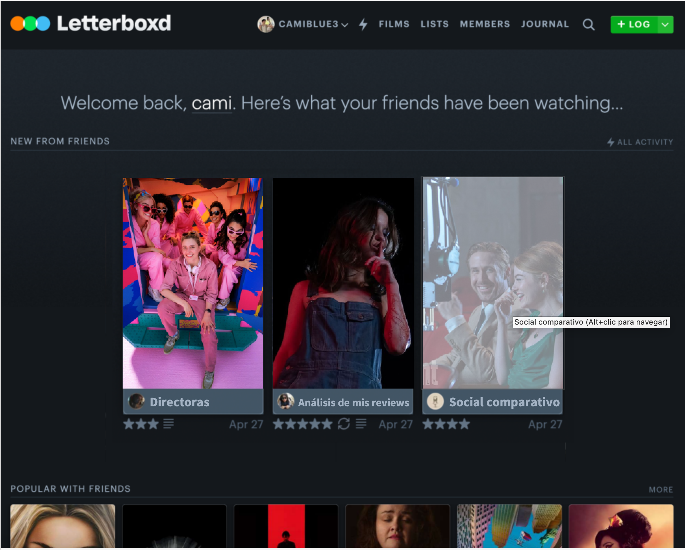

# 🎬 Letterboxd Film Analysis & Social Connectivity Dashboard

🌍 [**Read in English**](#-english-version) \| 🌎 [**Leer en Español**](#-versión-en-español)

------------------------------------------------------------------------

## 🇬🇧 English Version

### 📌 Overview

This project is an end-to-end Data Visualization and ETL pipeline built to analyze personal and social film consumption habits using data from Letterboxd. It goes beyond simple metrics to uncover deep insights regarding gender disparity in directing, personal geographic viewing biases, and statistical deviations against public consensus.

### 🏗️ Dashboard Architecture

The User Experience (UX) is designed around a centralized interactive menu acting as a portal to three long-form, scrollable analytical investigations:

1.  **The Directing Paradox (Gender Gap):** An analysis of the representation and critical reception of female vs. male directors in the industry.
2.  **Personal Analysis:** An exploration of personal rating biases, total watch time footprint, and the geographic distribution of consumed cinema.
3.  **Social Analysis (vs. Public & Peers):** A statistical comparison mapping personal ratings against the general Letterboxd consensus and a specific peer review (Mati) to identify echo chambers and polarizing films.

### 🛠️ Methodology & Tech Stack

- **Data Preparation (Tableau Prep):** Transformed a wide-format dataset with nested comma-separated values into a normalized, long-format relational model. Applied multiple *unpivot* operations to decouple overlapping categorical variables (Genres, Countries).
- **Data Visualization & UX (Tableau Desktop):** Built a highly interactive interface featuring scatter plots and geographic heatmaps. Implemented advanced **Custom Tooltips** and dynamic **URL Actions** linking directly to Letterboxd database pages or real news articles, providing narrative context (*hoverable analysis*) without visual clutter.

### 📊 Key Insights

1.  **The Directing Paradox:** While female directors represent a drastic minority in the dataset (only 7.9% of the films), their average rating significantly outperforms male directors (3.52 vs. 3.34).
2.  **Curation Bias:** The personal rating histogram is heavily left-skewed, confirming an active curation bias where anticipated films are selected, leading to a concentration of 3.5 - 4.5 ratings.
3.  **Consensus Deviation:** The 45-degree scatter plot analysis successfully isolated "polarizing" films, revealing specific titles where personal appreciation drastically diverged from the general Letterboxd audience average.
4.  **Geographic Bias & Viewing Footprint:** The global heatmap revealed a heavy concentration of North American and European productions, accumulating over 23 uninterrupted days of total watch time. This highlights mainstream distribution biases and presents an opportunity to explore underrepresented cinemas.

### 📂 Repository Structure

- [**Link to the interactive Dashboard on Tableau Public**](https://public.tableau.com/views/Dashboard_Letterboxd/General)
- `/data`:
  - `/raw`: Original, uncleaned Letterboxd dataset.
  - `/processed`: Denormalized datasets and social rating cross-tables (`letterboxd_denormalizado.csv`, `social_ratings_cross.csv`).
- `/prep_flow`: The Tableau Prep Builder `.tfl` workflow detailing the ETL process.
- `/imagenes`: Dashboard screenshots and visual resources for documentation.

------------------------------------------------------------------------

## 🇪🇸 Versión en Español

### 📌 Resumen

Este proyecto es un pipeline *end-to-end* de visualización de datos y ETL construido para analizar hábitos de consumo cinematográfico personal y social utilizando datos de Letterboxd. Va más allá de las métricas simples para descubrir *insights* profundos sobre la brecha de género en la industria, sesgos geográficos de visualización y desviaciones estadísticas frente al consenso del público.

### 🏗️ Arquitectura del Dashboard

La experiencia de usuario (UX) está diseñada con un menú interactivo central que actúa como portal hacia tres investigaciones analíticas de formato largo (*scrollable*):

1.  **Brecha de Género:** Análisis de la representación y recepción crítica de directoras vs. directores en la industria.
2.  **Análisis Personal:** Exploración de sesgos de calificación propios, huella de tiempo consumido y distribución geográfica del cine visto.
3.  **Análisis Social (vs. Público y Pares):** Comparativa estadística entre calificaciones personales, el consenso general de Letterboxd y reseñas de un usuario par (Mati) para detectar "cámaras de eco" y películas polarizantes.

### 🛠️ Metodología y Stack Tecnológico

- **Preparación de Datos (Tableau Prep):** Transformación de un dataset en formato ancho (con valores anidados separados por comas) a un modelo relacional normalizado. Se aplicaron múltiples operaciones de *unpivot* para desacoplar variables categóricas superpuestas (Géneros, Países).
- **Visualización de Datos y UX (Tableau Desktop):** Desarrollo de una interfaz interactiva que incluye gráficos de dispersión y mapas de calor. Se aplicó un uso avanzado de **Tooltips personalizados** y **Acciones de URL dinámicas** que redirigen directamente a las fichas técnicas de Letterboxd o a artículos de noticias reales, aportando contexto narrativo (*hoverable analysis*) sin saturar la carga visual.

### 📊 Principales Hallazgos

1.  **La Paradoja de la Dirección:** Aunque las directoras representan una minoría drástica en la base de datos (solo el 7.9% de las películas), su calificación promedio supera significativamente a la de los directores hombres (3.52 vs. 3.34).
2.  **Sesgo de Curación:** El histograma de calificaciones personales presenta una fuerte asimetría negativa (*left-skewed*), confirmando que se eligen activamente películas con alta expectativa, concentrando las notas entre 3.5 y 4.5.
3.  **Desviación del Consenso:** El análisis de dispersión en diagonal a 45 grados logró aislar con éxito películas "polarizantes", revelando títulos específicos donde la apreciación personal divergió drásticamente del promedio del público general.
4.  **Sesgo Geográfico y Huella de Consumo:** El mapa de calor global evidenció una fuerte concentración en producciones de Norteamérica y Europa, acumulando más de 23 días ininterrumpidos de tiempo de visualización. Este hallazgo visibiliza los sesgos de distribución del cine *mainstream* y marca una oportunidad para explorar cinematografías menos representadas.

### 📂 Estructura del Repositorio

- [**Link al Dashboard interactivo en Tableau Public**](https://public.tableau.com/views/Dashboard_Letterboxd/General)
- `/data`:
  - `/raw`: Dataset original de Letterboxd sin procesar.
  - `/processed`: Datasets desnormalizados y tablas cruzadas de calificaciones sociales (`letterboxd_denormalizado.csv`, `social_ratings_cross.csv`).
- `/prep_flow`: El flujo de limpieza `.tfl` de Tableau Prep Builder.
- `/imagenes`: Recursos visuales y capturas de pantalla del proyecto para la documentación.
